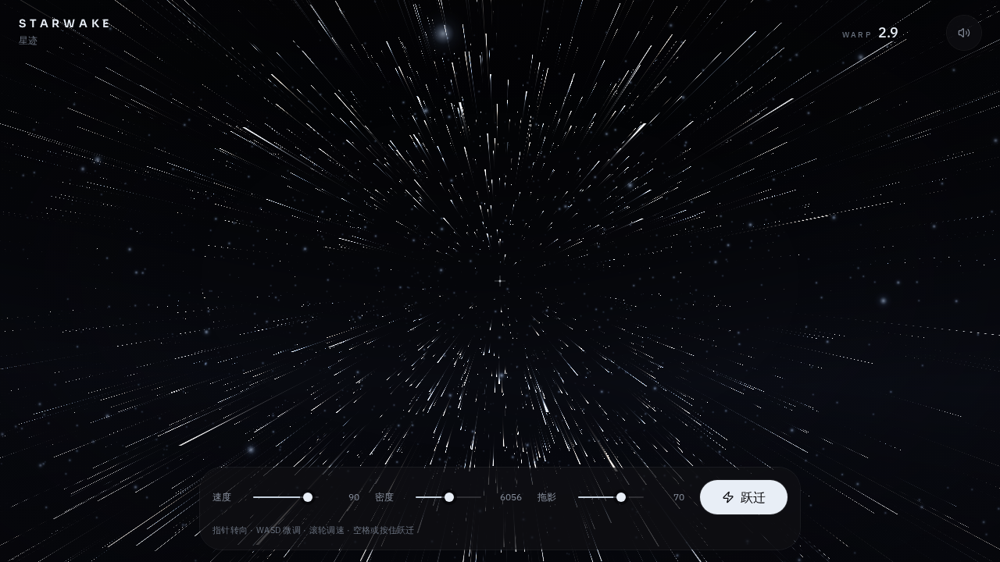

# Celestia Drift

**An immersive interactive 3D starfield experience** — navigate through procedurally generated stars, control your warp speed, and journey through the cosmos in real-time.



## ✨ Features

- 🌌 **Procedural Starfield** — Infinite generative starfield with varying densities
- 🚀 **Warp Speed Control** — Adjust velocity and experience stunning light trails
- 🎮 **Interactive Controls** — Pointer/touch-based navigation with smooth camera movement
- 🎨 **Modern UI** — Clean, minimalist HUD built with Radix UI and Tailwind CSS
- 🔊 **Dynamic Audio** — Reactive soundscapes that respond to your warp speed
- 📱 **Responsive Design** — Works seamlessly on desktop and mobile devices
- ⚡ **High Performance** — Optimized Three.js rendering with custom shaders

## 🛠️ Tech Stack

- **Framework**: React 19 with TanStack Start & Router
- **3D Engine**: Three.js with React Three Fiber
- **Styling**: Tailwind CSS v4 + Radix UI components
- **State Management**: Zustand
- **Build Tool**: Vite
- **Language**: TypeScript

## 🚀 Quick Start

### Prerequisites

- Node.js 22+
- npm

### Installation

```bash
# Install dependencies
npm install

# Start development server
npm run dev

# Build for production
npm run build

# Preview production build
npm run preview
```

The application will be available at `http://localhost:8080`.

## 🎮 How to Play

1. **Enter the Experience** — Click "进入星域" (Enter Starfield) to begin
2. **Navigate** — Move your pointer or drag on touch screens to change direction
3. **Control Speed** — Use the speed slider to adjust your velocity
4. **Warp Drive** — Hold the boost button to engage warp speed and see spectacular light trails
5. **Adjust Density** — Modify star density for different visual experiences

## 📁 Project Structure

```
/workspace
├── src/
│   ├── components/
│   │   └── starfield/       # Core 3D starfield components
│   │       ├── StarfieldExperience.tsx
│   │       ├── StarfieldScene.tsx
│   │       ├── Hud.tsx
│   │       ├── engine.ts    # Rendering engine
│   │       ├── input.ts     # Input handling
│   │       ├── state.ts     # State management
│   │       ├── shaders.ts   # Custom GLSL shaders
│   │       └── audio.ts     # Web Audio API integration
│   ├── routes/              # TanStack Router routes
│   ├── lib/                 # Shared utilities
│   └── styles.css           # Global styles
├── public/                  # Static assets
├── scripts/                 # Build and utility scripts
├── server/                  # Server middleware
└── migrations/              # Database migrations
```

## 🧪 Development Commands

```bash
# Run tests
npm test

# Type checking
npm run typecheck

# Linting
npm run lint

# Format code
npm run format

# Database migration
npm run db:migrate
```

## 🔧 开发说明

- `npm run typecheck` — 同时检查 `src`/`server` 与 `scripts`（两个 tsconfig 串联），任一报错即失败
- `npm run lint` — ESLint 门禁（含 no-floating-promises / no-misused-promises），必须 0 错误
- `npm test` — 跨平台测试（scripts 套件 + TS 套件），空套件视为失败，防止假绿
- `npm run db:migrate` — 递归应用 `migrations/` 下所有 SQL（含 `auth/` 子目录），按文件名记账、事务内建 `_migrations` 表；auth 相关表在部署构建时随迁移生效
- CI（`.github/workflows/ci.yml`）按 typecheck → lint → test → build 顺序把守，任一失败即拒绝合并

## 🌐 Deployment

This project is configured for deployment on **Vercel**. The build process includes:

- Automatic environment variable injection
- Database migrations
- PWA manifest generation
- Open Graph image optimization

## 📄 License

MIT License — see [LICENSE](LICENSE) for details.

## 🙏 Credits

Built with:
- [Three.js](https://threejs.org/) — 3D graphics library
- [React Three Fiber](https://docs.pmnd.rs/react-three-fiber/) — React renderer for Three.js
- [TanStack Start](https://tanstack.com/start) — Full-stack React framework
- [Tailwind CSS](https://tailwindcss.com/) — Utility-first CSS framework
- [Radix UI](https://www.radix-ui.com/) — Accessible UI components

---

**Celestia Drift** · maintained by [riceshowerX](https://github.com/riceshowerX)
